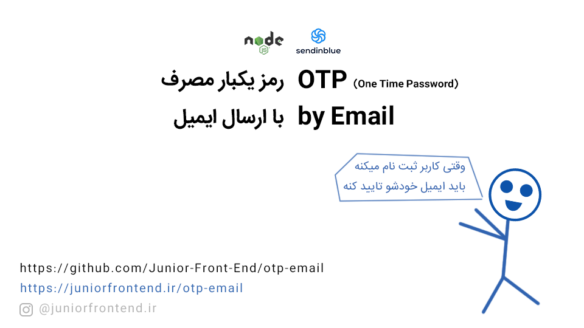

# <p dir="rtl">رمز یکبار مصرف OTP با Email</p>



<div dir="rtl">


[مقاله مرتبط]()
را بخوانید!

## راه اندازی

کافیست وارد صفحه `server/otp/OTP-Email.js` بشوید و 
بجای `YOUR-API-KEY` مقداری که از سایت SENDINBLUE اوردید جایگزین کنید!

سپس با کدهای زیر در ترمینال پکیج های مورد نیاز را نصب نمایید! و سرور را راه اندازی کنید!

```
yarn install 
yarn start
```

</div>